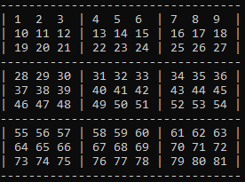
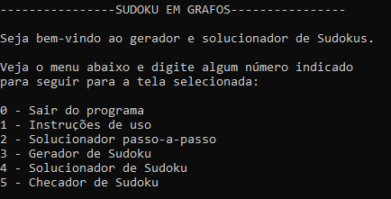
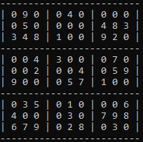
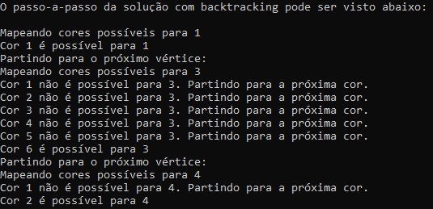
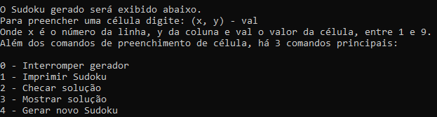

# P3 (TAG - 2021.1 - 202033202): Sudoku em Grafos
Projeto 3 de Teoria e Aplicação de Grafos, disciplina ofertada na Universidade de Brasília (UnB) no semestre 2021.1.
Desenvolvido por Gabriel Mendes Ciriatico Guimarães, de matrícula 202033202.

## Modelamento e Algoritmo

O projeto desenvolvido tem por função gerar Sudokus válidos, resolver Sudokus e checar a validade de soluções dadas. Para tanto, foi utilizado algoritmo de coloração de grafos a partir de um Sudoku modelado em grafo.

O Sudoku é uma matriz 9x9 didivido em 3 grupos: linhas, colunas e blocos. Cada célula da matriz pode receber um número entre 1 e 9 que não tenha sido usado na mesma linha, coluna ou bloco.

O problema foi modelado entendendo que cada vértice possui aresta com os vértices da mesma linha, coluna e bloco. Assim, na coloração de grafo é possível obter uma ordem de cores em que vértices ligados pela mesma aresta não possuem a mesma cor. Os vértices são nomeados de acordo com seu índice na matriz, com esse índice variando de 1 a 81. Na primeira linha, temos as células de 1 a 9, na segunda de 10 a 18, e assim até 81.

O grafo é modelado através de listas de adjacências. Os índices de cada célula podem ser observados na matriz abaixo:

<p align="center"></p>

Para o problema da coloração desse grafo, foi utilizado algoritmo de M coloração com backtracking. O algoritmo de M coloração permite que seja utilizado M = 9, o número de dígitos possíveis no Sudoku, para checar uma solução que utilize exatamente M cores.

O código do algoritmo se baseia principalmente no código e pseudocódigo feito por <a href="https://www.tutorialspoint.com/M-Coloring-Problem">Karthikeya Boyini (2018)</a>, tendo <a href="https://www.geeksforgeeks.org/m-coloring-problem-backtracking-5/">este artigo</a> também contribuído no desenvolvimento do programa.

Em resumo, é feito um laço recursivo que checa cada vértice do grafo. Se o vértice já é dado preenchido, pula-se para o próximo. Deste, é escolhido um dígito que ainda não foi utilizado por nenhum de seus vizinhos. O vértice recebe então esse dígito e se passa para o próximo nó. Quando se terminam os nós, foi encontrada uma solução e o backtracking ocorre. Então, o nó tem a cor que utilizava apagada e substituída por uma outra, passando-se para a coloração do próximo nó com a nova configuração. Ao fim, é possível obter todas as soluções possíveis.

No programa, esse algoritmo é usado de duas formas: na forma completa, que acha cada solução possível; e na forma eficiente, que busca apenas 1 solução e para.

## Regras do Sudoku

O Sudoku é um jogo formado em cima de uma matriz 9x9 com as seguintes regras:

 <ul>
  <li>O jogo é composto por uma matriz composta de 9 linhas, 9 colunas e 9 blocos;</li>
  <li>Os blocos são grupos de células de tamanho 9, abarcando todas as células a cada 3 linhas e 3 colunas;</li>
  <li>Cada célula deve ser preenchida com números entre 1 e 9;</li>
  <li>Não é possível a repetição de números por linha, coluna ou bloco;</li>
 <li>Cada linha, célula e bloco devem ter células que vão de 1 a 9;</li>
  <li>Cada Sudoku tem apenas 1 solução possível.</li>
</ul> 

## Compilação
Para utilizar o projeto desenvolvido, basta compilar o arquivo .py no terminal.

```console
python tag_p3_202033202.py
```

## Interface com Usuário

O programa utiliza uma interface com usuário para apresentar Sudokus, receber Sudokus e checar Sudokus preenchidos pelo usuário. A interface com o usuário é feita através do terminal, com a navegação por teclas.

Existem 4 funcionalidades principais: um solucionador de um Sudoku aleatório mostrando o passo-a-passo da aplicação do algoritmo; um gerador de Sudoku que permite que o usuário preencha cada célula e cheque se a solução está correta, bem como obter a solução do Sudoku gerado; um solucionador de Sudoku, que resolve um Sudoku dado pelo usuário; e um checador de Sudoku, que checa a validade de uma solução dada pelo usuário.

Essas funcionalidades podem ser selecionadas no menu principal do programa:

<p align="center"></p>

A tela de instruções mostra informações sobre como usar o programa, que já estão contidas aqui.

### Solucionador passo-a-passo

O solucionador passo-a-passo não aceita entrada de dados pelo usuário. Nele, é gerado um Sudoku aleatório, que é resolvido e cuja solução passo-a-passo é imprimida na tela.

Como exemplo, temos o Sudoku a seguir:
 
<p align="center"></p>
 
As primeiras linhas da solução passo-a-passo podem ser vistas abaixo:

<p align="center"></p>

### Gerador de Sudoku

O gerador de Sudoku pode ser usado tanto simplesmente para gerar novos jogos de Sudoku como para preenchê-los pelo terminal e checar a validade da solução.

<p align="center"></p>

Para preencher as células, é preciso inserir os dados no formato:

(x, y) - val

Onde x é a linha e y a célula do vértice (seguindo os índices já exibidos), e val é um dígito de 1 a 9.

### Solucionador de Sudoku

O solucionador de Sudoku recebe os valores de cada célula pelo terminal. Aqui, os valores são inseridos diretamente célula por célula, sem necessidade de colocar a posição do vértice. O dígito 0 representa uma célula não preenchida no Sudoku.

### Checador de Sudoku

O checador de Sudoku também apenas recebe os dados do usuário célula por célula, de 1 a 81.

## License
[MIT](https://choosealicense.com/licenses/mit/)
